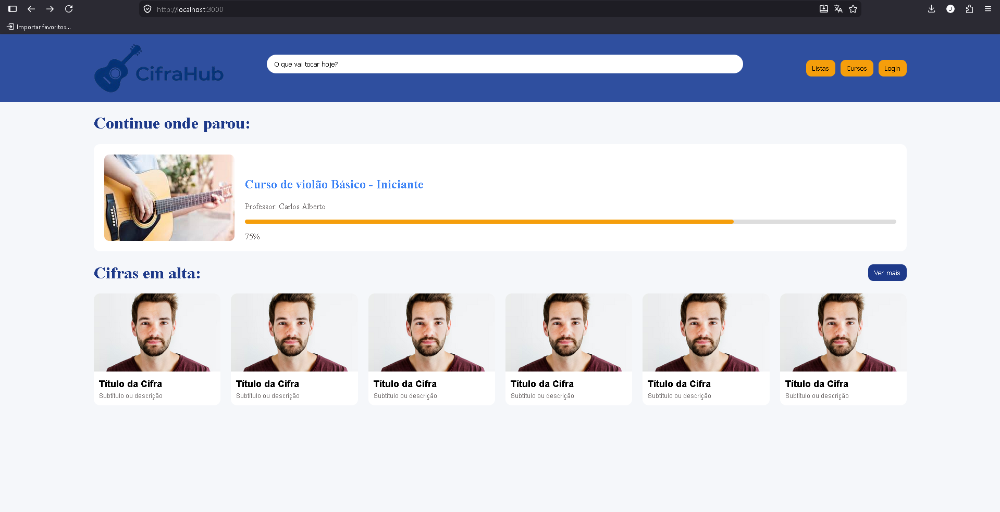
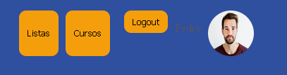
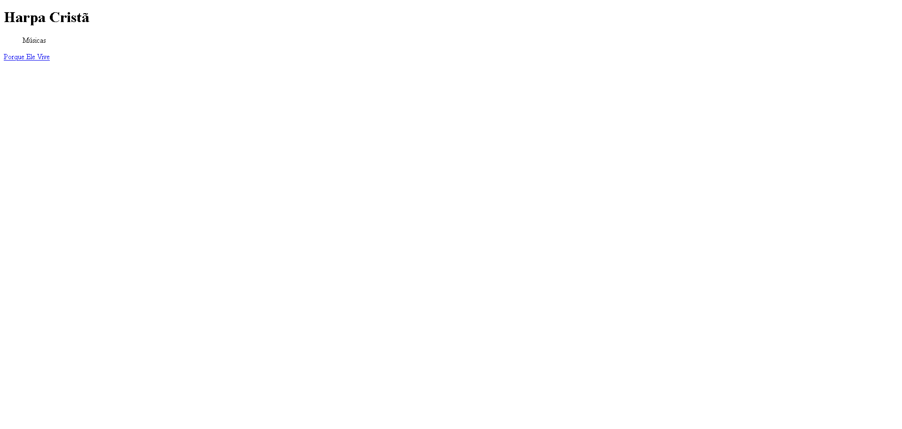
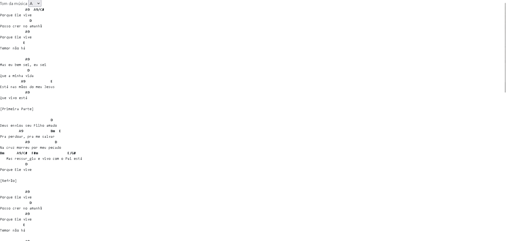
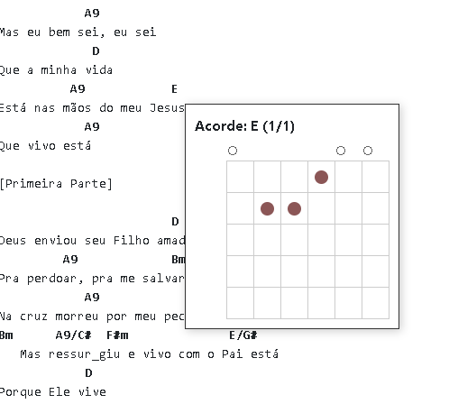

*Plataforma de Ensino Musical*

Aplicação web desenvolvida como Trabalho de Conclusão de Curso (TCC), com foco no ensino informal de música e compartilhamento de cifras.

*Funcionalidades*
- Cadastro de músicas
- Associação com artistas
- Exibição de cifras
- Organização por acordes

*Tecnologias utilizadas*
- Node.js
- JavaScript
- MySQL 

## ▶️ Como executar

1. Instale as dependências:
npm install

2. Configure o banco de dados

3. Inicie o servidor:
npm start

Tela inicial:

Usuário Logado

Pesquisar uma Música

Músicas de um artista

Vizualização de uma cifra

Mostrar acordes na tela

